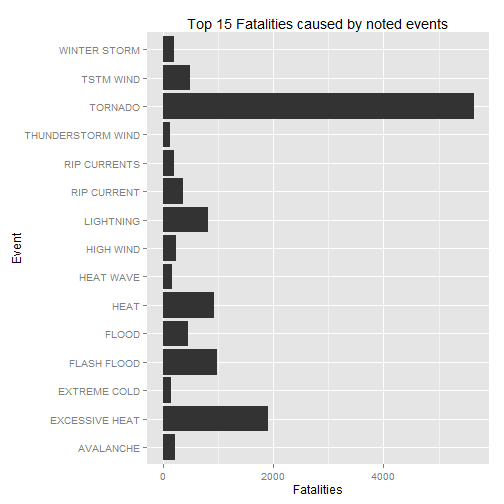
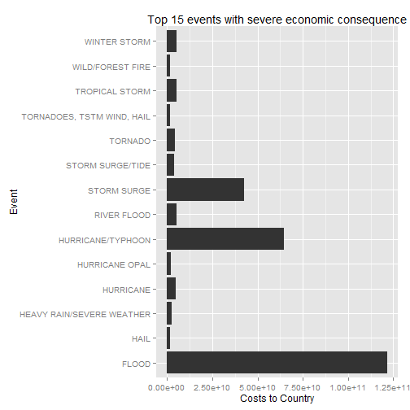

### A. Synopsis
Storms and other severe weather events can cause both public health and economic problems for communities and municipalities. Many severe events can result in fatalities, injuries, and property damage, and preventing such outcomes to the extent possible is a key concern.

This project involves exploring the U.S. National Oceanic and Atmospheric Administration's (NOAA) storm database. This database tracks characteristics of major storms and weather events in the United States, including when and where they occur, as well as estimates of any fatalities, injuries, and property damage.

Chiefly this document addresses

*Across the United States, which types of events are most harmful with respect to population health?

*Across the United States, which types of events have the greatest economic consequences?

### B. Data Processing 
The data for this assignment come in the form of a comma-separated-value file compressed via the bzip2 algorithm to reduce its size. 
The events in the database start in the year 1950 and end in November 2011. In the earlier years of the database there are generally fewer events recorded, most likely due to a lack of good records. More recent years should be considered more complete.

#### _B.1 Load Libraries_


```r
library(ggplot2)
library(plyr)
```
#### _B.2 Set work directory & Load Data_


```r
setwd("~/Coursera/5/RepData_PeerAssessment2")

data <- file.path(getwd(), "StormData.csv.bz2")
readData <- read.csv(data, stringsAsFactors = FALSE)
```

#### _B.3 Data Analyze View_

##### _B.3.1 View data using class and str and summary_

```r
class(readData)
```

```
## [1] "data.frame"
```

```r
str(readData)
```

```
## 'data.frame':	902297 obs. of  37 variables:
##  $ STATE__   : num  1 1 1 1 1 1 1 1 1 1 ...
##  $ BGN_DATE  : chr  "4/18/1950 0:00:00" "4/18/1950 0:00:00" "2/20/1951 0:00:00" "6/8/1951 0:00:00" ...
##  $ BGN_TIME  : chr  "0130" "0145" "1600" "0900" ...
##  $ TIME_ZONE : chr  "CST" "CST" "CST" "CST" ...
##  $ COUNTY    : num  97 3 57 89 43 77 9 123 125 57 ...
##  $ COUNTYNAME: chr  "MOBILE" "BALDWIN" "FAYETTE" "MADISON" ...
##  $ STATE     : chr  "AL" "AL" "AL" "AL" ...
##  $ EVTYPE    : chr  "TORNADO" "TORNADO" "TORNADO" "TORNADO" ...
##  $ BGN_RANGE : num  0 0 0 0 0 0 0 0 0 0 ...
##  $ BGN_AZI   : chr  "" "" "" "" ...
##  $ BGN_LOCATI: chr  "" "" "" "" ...
##  $ END_DATE  : chr  "" "" "" "" ...
##  $ END_TIME  : chr  "" "" "" "" ...
##  $ COUNTY_END: num  0 0 0 0 0 0 0 0 0 0 ...
##  $ COUNTYENDN: logi  NA NA NA NA NA NA ...
##  $ END_RANGE : num  0 0 0 0 0 0 0 0 0 0 ...
##  $ END_AZI   : chr  "" "" "" "" ...
##  $ END_LOCATI: chr  "" "" "" "" ...
##  $ LENGTH    : num  14 2 0.1 0 0 1.5 1.5 0 3.3 2.3 ...
##  $ WIDTH     : num  100 150 123 100 150 177 33 33 100 100 ...
##  $ F         : int  3 2 2 2 2 2 2 1 3 3 ...
##  $ MAG       : num  0 0 0 0 0 0 0 0 0 0 ...
##  $ FATALITIES: num  0 0 0 0 0 0 0 0 1 0 ...
##  $ INJURIES  : num  15 0 2 2 2 6 1 0 14 0 ...
##  $ PROPDMG   : num  25 2.5 25 2.5 2.5 2.5 2.5 2.5 25 25 ...
##  $ PROPDMGEXP: chr  "K" "K" "K" "K" ...
##  $ CROPDMG   : num  0 0 0 0 0 0 0 0 0 0 ...
##  $ CROPDMGEXP: chr  "" "" "" "" ...
##  $ WFO       : chr  "" "" "" "" ...
##  $ STATEOFFIC: chr  "" "" "" "" ...
##  $ ZONENAMES : chr  "" "" "" "" ...
##  $ LATITUDE  : num  3040 3042 3340 3458 3412 ...
##  $ LONGITUDE : num  8812 8755 8742 8626 8642 ...
##  $ LATITUDE_E: num  3051 0 0 0 0 ...
##  $ LONGITUDE_: num  8806 0 0 0 0 ...
##  $ REMARKS   : chr  "" "" "" "" ...
##  $ REFNUM    : num  1 2 3 4 5 6 7 8 9 10 ...
```

```r
summary(readData)
```

```
##     STATE__       BGN_DATE           BGN_TIME          TIME_ZONE        
##  Min.   : 1.0   Length:902297      Length:902297      Length:902297     
##  1st Qu.:19.0   Class :character   Class :character   Class :character  
##  Median :30.0   Mode  :character   Mode  :character   Mode  :character  
##  Mean   :31.2                                                           
##  3rd Qu.:45.0                                                           
##  Max.   :95.0                                                           
##                                                                         
##      COUNTY       COUNTYNAME           STATE              EVTYPE         
##  Min.   :  0.0   Length:902297      Length:902297      Length:902297     
##  1st Qu.: 31.0   Class :character   Class :character   Class :character  
##  Median : 75.0   Mode  :character   Mode  :character   Mode  :character  
##  Mean   :100.6                                                           
##  3rd Qu.:131.0                                                           
##  Max.   :873.0                                                           
##                                                                          
##    BGN_RANGE          BGN_AZI           BGN_LOCATI       
##  Min.   :   0.000   Length:902297      Length:902297     
##  1st Qu.:   0.000   Class :character   Class :character  
##  Median :   0.000   Mode  :character   Mode  :character  
##  Mean   :   1.484                                        
##  3rd Qu.:   1.000                                        
##  Max.   :3749.000                                        
##                                                          
##    END_DATE           END_TIME           COUNTY_END COUNTYENDN    
##  Length:902297      Length:902297      Min.   :0    Mode:logical  
##  Class :character   Class :character   1st Qu.:0    NA's:902297   
##  Mode  :character   Mode  :character   Median :0                  
##                                        Mean   :0                  
##                                        3rd Qu.:0                  
##                                        Max.   :0                  
##                                                                   
##    END_RANGE          END_AZI           END_LOCATI       
##  Min.   :  0.0000   Length:902297      Length:902297     
##  1st Qu.:  0.0000   Class :character   Class :character  
##  Median :  0.0000   Mode  :character   Mode  :character  
##  Mean   :  0.9862                                        
##  3rd Qu.:  0.0000                                        
##  Max.   :925.0000                                        
##                                                          
##      LENGTH              WIDTH                F               MAG         
##  Min.   :   0.0000   Min.   :   0.000   Min.   :0.0      Min.   :    0.0  
##  1st Qu.:   0.0000   1st Qu.:   0.000   1st Qu.:0.0      1st Qu.:    0.0  
##  Median :   0.0000   Median :   0.000   Median :1.0      Median :   50.0  
##  Mean   :   0.2301   Mean   :   7.503   Mean   :0.9      Mean   :   46.9  
##  3rd Qu.:   0.0000   3rd Qu.:   0.000   3rd Qu.:1.0      3rd Qu.:   75.0  
##  Max.   :2315.0000   Max.   :4400.000   Max.   :5.0      Max.   :22000.0  
##                                         NA's   :843563                    
##    FATALITIES          INJURIES            PROPDMG       
##  Min.   :  0.0000   Min.   :   0.0000   Min.   :   0.00  
##  1st Qu.:  0.0000   1st Qu.:   0.0000   1st Qu.:   0.00  
##  Median :  0.0000   Median :   0.0000   Median :   0.00  
##  Mean   :  0.0168   Mean   :   0.1557   Mean   :  12.06  
##  3rd Qu.:  0.0000   3rd Qu.:   0.0000   3rd Qu.:   0.50  
##  Max.   :583.0000   Max.   :1700.0000   Max.   :5000.00  
##                                                          
##   PROPDMGEXP           CROPDMG         CROPDMGEXP       
##  Length:902297      Min.   :  0.000   Length:902297     
##  Class :character   1st Qu.:  0.000   Class :character  
##  Mode  :character   Median :  0.000   Mode  :character  
##                     Mean   :  1.527                     
##                     3rd Qu.:  0.000                     
##                     Max.   :990.000                     
##                                                         
##      WFO             STATEOFFIC         ZONENAMES            LATITUDE   
##  Length:902297      Length:902297      Length:902297      Min.   :   0  
##  Class :character   Class :character   Class :character   1st Qu.:2802  
##  Mode  :character   Mode  :character   Mode  :character   Median :3540  
##                                                           Mean   :2875  
##                                                           3rd Qu.:4019  
##                                                           Max.   :9706  
##                                                           NA's   :47    
##    LONGITUDE        LATITUDE_E     LONGITUDE_       REMARKS         
##  Min.   :-14451   Min.   :   0   Min.   :-14455   Length:902297     
##  1st Qu.:  7247   1st Qu.:   0   1st Qu.:     0   Class :character  
##  Median :  8707   Median :   0   Median :     0   Mode  :character  
##  Mean   :  6940   Mean   :1452   Mean   :  3509                     
##  3rd Qu.:  9605   3rd Qu.:3549   3rd Qu.:  8735                     
##  Max.   : 17124   Max.   :9706   Max.   :106220                     
##                   NA's   :40                                        
##      REFNUM      
##  Min.   :     1  
##  1st Qu.:225575  
##  Median :451149  
##  Mean   :451149  
##  3rd Qu.:676723  
##  Max.   :902297  
## 
```

*This indicates tha there are 902297 observations ; 37 variables

##### _B.3.2 View the unique EVTYPE contents_

```r
sort(unique(readData$EVTYPE))
```

```
##   [1] "   HIGH SURF ADVISORY"          " COASTAL FLOOD"                
##   [3] " FLASH FLOOD"                   " LIGHTNING"                    
##   [5] " TSTM WIND"                     " TSTM WIND (G45)"              
##   [7] " WATERSPOUT"                    " WIND"                         
##   [9] "?"                              "ABNORMAL WARMTH"               
##  [11] "ABNORMALLY DRY"                 "ABNORMALLY WET"                
##  [13] "ACCUMULATED SNOWFALL"           "AGRICULTURAL FREEZE"           
##  [15] "APACHE COUNTY"                  "ASTRONOMICAL HIGH TIDE"        
##  [17] "ASTRONOMICAL LOW TIDE"          "AVALANCE"                      
##  [19] "AVALANCHE"                      "BEACH EROSIN"                  
##  [21] "Beach Erosion"                  "BEACH EROSION"                 
##  [23] "BEACH EROSION/COASTAL FLOOD"    "BEACH FLOOD"                   
##  [25] "BELOW NORMAL PRECIPITATION"     "BITTER WIND CHILL"             
##  [27] "BITTER WIND CHILL TEMPERATURES" "Black Ice"                     
##  [29] "BLACK ICE"                      "BLIZZARD"                      
##  [31] "BLIZZARD AND EXTREME WIND CHIL" "BLIZZARD AND HEAVY SNOW"       
##  [33] "Blizzard Summary"               "BLIZZARD WEATHER"              
##  [35] "BLIZZARD/FREEZING RAIN"         "BLIZZARD/HEAVY SNOW"           
##  [37] "BLIZZARD/HIGH WIND"             "BLIZZARD/WINTER STORM"         
##  [39] "BLOW-OUT TIDE"                  "BLOW-OUT TIDES"                
##  [41] "BLOWING DUST"                   "blowing snow"                  
##  [43] "Blowing Snow"                   "BLOWING SNOW"                  
##  [45] "BLOWING SNOW- EXTREME WIND CHI" "BLOWING SNOW & EXTREME WIND CH"
##  [47] "BLOWING SNOW/EXTREME WIND CHIL" "BREAKUP FLOODING"              
##  [49] "BRUSH FIRE"                     "BRUSH FIRES"                   
##  [51] "COASTAL  FLOODING/EROSION"      "COASTAL EROSION"               
##  [53] "Coastal Flood"                  "COASTAL FLOOD"                 
##  [55] "coastal flooding"               "Coastal Flooding"              
##  [57] "COASTAL FLOODING"               "COASTAL FLOODING/EROSION"      
##  [59] "Coastal Storm"                  "COASTAL STORM"                 
##  [61] "COASTAL SURGE"                  "COASTAL/TIDAL FLOOD"           
##  [63] "COASTALFLOOD"                   "COASTALSTORM"                  
##  [65] "Cold"                           "COLD"                          
##  [67] "COLD AIR FUNNEL"                "COLD AIR FUNNELS"              
##  [69] "COLD AIR TORNADO"               "Cold and Frost"                
##  [71] "COLD AND FROST"                 "COLD AND SNOW"                 
##  [73] "COLD AND WET CONDITIONS"        "Cold Temperature"              
##  [75] "COLD TEMPERATURES"              "COLD WAVE"                     
##  [77] "COLD WEATHER"                   "COLD WIND CHILL TEMPERATURES"  
##  [79] "COLD/WIND CHILL"                "COLD/WINDS"                    
##  [81] "COOL AND WET"                   "COOL SPELL"                    
##  [83] "CSTL FLOODING/EROSION"          "DAM BREAK"                     
##  [85] "DAM FAILURE"                    "Damaging Freeze"               
##  [87] "DAMAGING FREEZE"                "DEEP HAIL"                     
##  [89] "DENSE FOG"                      "DENSE SMOKE"                   
##  [91] "DOWNBURST"                      "DOWNBURST WINDS"               
##  [93] "DRIEST MONTH"                   "Drifting Snow"                 
##  [95] "DROUGHT"                        "DROUGHT/EXCESSIVE HEAT"        
##  [97] "DROWNING"                       "DRY"                           
##  [99] "DRY CONDITIONS"                 "DRY HOT WEATHER"               
## [101] "DRY MICROBURST"                 "DRY MICROBURST 50"             
## [103] "DRY MICROBURST 53"              "DRY MICROBURST 58"             
## [105] "DRY MICROBURST 61"              "DRY MICROBURST 84"             
## [107] "DRY MICROBURST WINDS"           "DRY MIRCOBURST WINDS"          
## [109] "DRY PATTERN"                    "DRY SPELL"                     
## [111] "DRY WEATHER"                    "DRYNESS"                       
## [113] "DUST DEVEL"                     "Dust Devil"                    
## [115] "DUST DEVIL"                     "DUST DEVIL WATERSPOUT"         
## [117] "DUST STORM"                     "DUST STORM/HIGH WINDS"         
## [119] "DUSTSTORM"                      "EARLY FREEZE"                  
## [121] "Early Frost"                    "EARLY FROST"                   
## [123] "EARLY RAIN"                     "EARLY SNOW"                    
## [125] "Early snowfall"                 "EARLY SNOWFALL"                
## [127] "Erosion/Cstl Flood"             "EXCESSIVE"                     
## [129] "Excessive Cold"                 "EXCESSIVE HEAT"                
## [131] "EXCESSIVE HEAT/DROUGHT"         "EXCESSIVE PRECIPITATION"       
## [133] "EXCESSIVE RAIN"                 "EXCESSIVE RAINFALL"            
## [135] "EXCESSIVE SNOW"                 "EXCESSIVE WETNESS"             
## [137] "EXCESSIVELY DRY"                "Extended Cold"                 
## [139] "Extreme Cold"                   "EXTREME COLD"                  
## [141] "EXTREME COLD/WIND CHILL"        "EXTREME HEAT"                  
## [143] "EXTREME WIND CHILL"             "EXTREME WIND CHILL/BLOWING SNO"
## [145] "EXTREME WIND CHILLS"            "EXTREME WINDCHILL"             
## [147] "EXTREME WINDCHILL TEMPERATURES" "EXTREME/RECORD COLD"           
## [149] "EXTREMELY WET"                  "FALLING SNOW/ICE"              
## [151] "FIRST FROST"                    "FIRST SNOW"                    
## [153] "FLASH FLOOD"                    "FLASH FLOOD - HEAVY RAIN"      
## [155] "FLASH FLOOD FROM ICE JAMS"      "FLASH FLOOD LANDSLIDES"        
## [157] "FLASH FLOOD WINDS"              "FLASH FLOOD/"                  
## [159] "FLASH FLOOD/ FLOOD"             "FLASH FLOOD/ STREET"           
## [161] "FLASH FLOOD/FLOOD"              "FLASH FLOOD/HEAVY RAIN"        
## [163] "FLASH FLOOD/LANDSLIDE"          "FLASH FLOODING"                
## [165] "FLASH FLOODING/FLOOD"           "FLASH FLOODING/THUNDERSTORM WI"
## [167] "FLASH FLOODS"                   "FLASH FLOOODING"               
## [169] "Flood"                          "FLOOD"                         
## [171] "FLOOD & HEAVY RAIN"             "FLOOD FLASH"                   
## [173] "FLOOD FLOOD/FLASH"              "FLOOD WATCH/"                  
## [175] "FLOOD/FLASH"                    "Flood/Flash Flood"             
## [177] "FLOOD/FLASH FLOOD"              "FLOOD/FLASH FLOODING"          
## [179] "FLOOD/FLASH/FLOOD"              "FLOOD/FLASHFLOOD"              
## [181] "FLOOD/RAIN/WIND"                "FLOOD/RAIN/WINDS"              
## [183] "FLOOD/RIVER FLOOD"              "Flood/Strong Wind"             
## [185] "FLOODING"                       "FLOODING/HEAVY RAIN"           
## [187] "FLOODS"                         "FOG"                           
## [189] "FOG AND COLD TEMPERATURES"      "FOREST FIRES"                  
## [191] "Freeze"                         "FREEZE"                        
## [193] "Freezing drizzle"               "Freezing Drizzle"              
## [195] "FREEZING DRIZZLE"               "FREEZING DRIZZLE AND FREEZING" 
## [197] "Freezing Fog"                   "FREEZING FOG"                  
## [199] "Freezing rain"                  "Freezing Rain"                 
## [201] "FREEZING RAIN"                  "FREEZING RAIN AND SLEET"       
## [203] "FREEZING RAIN AND SNOW"         "FREEZING RAIN SLEET AND"       
## [205] "FREEZING RAIN SLEET AND LIGHT"  "FREEZING RAIN/SLEET"           
## [207] "FREEZING RAIN/SNOW"             "Freezing Spray"                
## [209] "Frost"                          "FROST"                         
## [211] "Frost/Freeze"                   "FROST/FREEZE"                  
## [213] "FROST\\FREEZE"                  "FUNNEL"                        
## [215] "Funnel Cloud"                   "FUNNEL CLOUD"                  
## [217] "FUNNEL CLOUD."                  "FUNNEL CLOUD/HAIL"             
## [219] "FUNNEL CLOUDS"                  "FUNNELS"                       
## [221] "Glaze"                          "GLAZE"                         
## [223] "GLAZE ICE"                      "GLAZE/ICE STORM"               
## [225] "gradient wind"                  "Gradient wind"                 
## [227] "GRADIENT WIND"                  "GRADIENT WINDS"                
## [229] "GRASS FIRES"                    "GROUND BLIZZARD"               
## [231] "GUSTNADO"                       "GUSTNADO AND"                  
## [233] "GUSTY LAKE WIND"                "GUSTY THUNDERSTORM WIND"       
## [235] "GUSTY THUNDERSTORM WINDS"       "Gusty Wind"                    
## [237] "GUSTY WIND"                     "GUSTY WIND/HAIL"               
## [239] "GUSTY WIND/HVY RAIN"            "Gusty wind/rain"               
## [241] "Gusty winds"                    "Gusty Winds"                   
## [243] "GUSTY WINDS"                    "HAIL"                          
## [245] "HAIL 0.75"                      "HAIL 0.88"                     
## [247] "HAIL 075"                       "HAIL 088"                      
## [249] "HAIL 1.00"                      "HAIL 1.75"                     
## [251] "HAIL 1.75)"                     "HAIL 100"                      
## [253] "HAIL 125"                       "HAIL 150"                      
## [255] "HAIL 175"                       "HAIL 200"                      
## [257] "HAIL 225"                       "HAIL 275"                      
## [259] "HAIL 450"                       "HAIL 75"                       
## [261] "HAIL 80"                        "HAIL 88"                       
## [263] "HAIL ALOFT"                     "HAIL DAMAGE"                   
## [265] "HAIL FLOODING"                  "HAIL STORM"                    
## [267] "Hail(0.75)"                     "HAIL/ICY ROADS"                
## [269] "HAIL/WIND"                      "HAIL/WINDS"                    
## [271] "HAILSTORM"                      "HAILSTORMS"                    
## [273] "HARD FREEZE"                    "HAZARDOUS SURF"                
## [275] "HEAT"                           "HEAT DROUGHT"                  
## [277] "Heat Wave"                      "HEAT WAVE"                     
## [279] "HEAT WAVE DROUGHT"              "HEAT WAVES"                    
## [281] "HEAT/DROUGHT"                   "Heatburst"                     
## [283] "HEAVY LAKE SNOW"                "HEAVY MIX"                     
## [285] "HEAVY PRECIPATATION"            "Heavy Precipitation"           
## [287] "HEAVY PRECIPITATION"            "Heavy rain"                    
## [289] "Heavy Rain"                     "HEAVY RAIN"                    
## [291] "HEAVY RAIN AND FLOOD"           "Heavy Rain and Wind"           
## [293] "HEAVY RAIN EFFECTS"             "HEAVY RAIN/FLOODING"           
## [295] "Heavy Rain/High Surf"           "HEAVY RAIN/LIGHTNING"          
## [297] "HEAVY RAIN/MUDSLIDES/FLOOD"     "HEAVY RAIN/SEVERE WEATHER"     
## [299] "HEAVY RAIN/SMALL STREAM URBAN"  "HEAVY RAIN/SNOW"               
## [301] "HEAVY RAIN/URBAN FLOOD"         "HEAVY RAIN/WIND"               
## [303] "HEAVY RAIN; URBAN FLOOD WINDS;" "HEAVY RAINFALL"                
## [305] "HEAVY RAINS"                    "HEAVY RAINS/FLOODING"          
## [307] "HEAVY SEAS"                     "HEAVY SHOWER"                  
## [309] "HEAVY SHOWERS"                  "HEAVY SNOW"                    
## [311] "HEAVY SNOW-SQUALLS"             "HEAVY SNOW   FREEZING RAIN"    
## [313] "HEAVY SNOW & ICE"               "HEAVY SNOW AND"                
## [315] "HEAVY SNOW AND HIGH WINDS"      "HEAVY SNOW AND ICE"            
## [317] "HEAVY SNOW AND ICE STORM"       "HEAVY SNOW AND STRONG WINDS"   
## [319] "HEAVY SNOW ANDBLOWING SNOW"     "Heavy snow shower"             
## [321] "HEAVY SNOW SQUALLS"             "HEAVY SNOW/BLIZZARD"           
## [323] "HEAVY SNOW/BLIZZARD/AVALANCHE"  "HEAVY SNOW/BLOWING SNOW"       
## [325] "HEAVY SNOW/FREEZING RAIN"       "HEAVY SNOW/HIGH"               
## [327] "HEAVY SNOW/HIGH WIND"           "HEAVY SNOW/HIGH WINDS"         
## [329] "HEAVY SNOW/HIGH WINDS & FLOOD"  "HEAVY SNOW/HIGH WINDS/FREEZING"
## [331] "HEAVY SNOW/ICE"                 "HEAVY SNOW/ICE STORM"          
## [333] "HEAVY SNOW/SLEET"               "HEAVY SNOW/SQUALLS"            
## [335] "HEAVY SNOW/WIND"                "HEAVY SNOW/WINTER STORM"       
## [337] "HEAVY SNOWPACK"                 "Heavy Surf"                    
## [339] "HEAVY SURF"                     "Heavy surf and wind"           
## [341] "HEAVY SURF COASTAL FLOODING"    "HEAVY SURF/HIGH SURF"          
## [343] "HEAVY SWELLS"                   "HEAVY WET SNOW"                
## [345] "HIGH"                           "HIGH  SWELLS"                  
## [347] "HIGH  WINDS"                    "HIGH SEAS"                     
## [349] "High Surf"                      "HIGH SURF"                     
## [351] "HIGH SURF ADVISORIES"           "HIGH SURF ADVISORY"            
## [353] "HIGH SWELLS"                    "HIGH TEMPERATURE RECORD"       
## [355] "HIGH TIDES"                     "HIGH WATER"                    
## [357] "HIGH WAVES"                     "High Wind"                     
## [359] "HIGH WIND"                      "HIGH WIND (G40)"               
## [361] "HIGH WIND 48"                   "HIGH WIND 63"                  
## [363] "HIGH WIND 70"                   "HIGH WIND AND HEAVY SNOW"      
## [365] "HIGH WIND AND HIGH TIDES"       "HIGH WIND AND SEAS"            
## [367] "HIGH WIND DAMAGE"               "HIGH WIND/ BLIZZARD"           
## [369] "HIGH WIND/BLIZZARD"             "HIGH WIND/BLIZZARD/FREEZING RA"
## [371] "HIGH WIND/HEAVY SNOW"           "HIGH WIND/LOW WIND CHILL"      
## [373] "HIGH WIND/SEAS"                 "HIGH WIND/WIND CHILL"          
## [375] "HIGH WIND/WIND CHILL/BLIZZARD"  "HIGH WINDS"                    
## [377] "HIGH WINDS 55"                  "HIGH WINDS 57"                 
## [379] "HIGH WINDS 58"                  "HIGH WINDS 63"                 
## [381] "HIGH WINDS 66"                  "HIGH WINDS 67"                 
## [383] "HIGH WINDS 73"                  "HIGH WINDS 76"                 
## [385] "HIGH WINDS 80"                  "HIGH WINDS 82"                 
## [387] "HIGH WINDS AND WIND CHILL"      "HIGH WINDS DUST STORM"         
## [389] "HIGH WINDS HEAVY RAINS"         "HIGH WINDS/"                   
## [391] "HIGH WINDS/COASTAL FLOOD"       "HIGH WINDS/COLD"               
## [393] "HIGH WINDS/FLOODING"            "HIGH WINDS/HEAVY RAIN"         
## [395] "HIGH WINDS/SNOW"                "HIGHWAY FLOODING"              
## [397] "Hot and Dry"                    "HOT PATTERN"                   
## [399] "HOT SPELL"                      "HOT WEATHER"                   
## [401] "HOT/DRY PATTERN"                "HURRICANE"                     
## [403] "HURRICANE-GENERATED SWELLS"     "Hurricane Edouard"             
## [405] "HURRICANE EMILY"                "HURRICANE ERIN"                
## [407] "HURRICANE FELIX"                "HURRICANE GORDON"              
## [409] "HURRICANE OPAL"                 "HURRICANE OPAL/HIGH WINDS"     
## [411] "HURRICANE/TYPHOON"              "HVY RAIN"                      
## [413] "HYPERTHERMIA/EXPOSURE"          "HYPOTHERMIA"                   
## [415] "Hypothermia/Exposure"           "HYPOTHERMIA/EXPOSURE"          
## [417] "ICE"                            "ICE AND SNOW"                  
## [419] "ICE FLOES"                      "Ice Fog"                       
## [421] "ICE JAM"                        "Ice jam flood (minor"          
## [423] "ICE JAM FLOODING"               "ICE ON ROAD"                   
## [425] "ICE PELLETS"                    "ICE ROADS"                     
## [427] "ICE STORM"                      "ICE STORM AND SNOW"            
## [429] "ICE STORM/FLASH FLOOD"          "Ice/Snow"                      
## [431] "ICE/SNOW"                       "ICE/STRONG WINDS"              
## [433] "Icestorm/Blizzard"              "Icy Roads"                     
## [435] "ICY ROADS"                      "LACK OF SNOW"                  
## [437] "LAKE-EFFECT SNOW"               "Lake Effect Snow"              
## [439] "LAKE EFFECT SNOW"               "LAKE FLOOD"                    
## [441] "LAKESHORE FLOOD"                "LANDSLIDE"                     
## [443] "LANDSLIDE/URBAN FLOOD"          "LANDSLIDES"                    
## [445] "Landslump"                      "LANDSLUMP"                     
## [447] "LANDSPOUT"                      "LARGE WALL CLOUD"              
## [449] "Late-season Snowfall"           "LATE FREEZE"                   
## [451] "LATE SEASON HAIL"               "LATE SEASON SNOW"              
## [453] "Late Season Snowfall"           "LATE SNOW"                     
## [455] "LIGHT FREEZING RAIN"            "Light snow"                    
## [457] "Light Snow"                     "LIGHT SNOW"                    
## [459] "LIGHT SNOW AND SLEET"           "Light Snow/Flurries"           
## [461] "LIGHT SNOW/FREEZING PRECIP"     "Light Snowfall"                
## [463] "LIGHTING"                       "LIGHTNING"                     
## [465] "LIGHTNING  WAUSEON"             "LIGHTNING AND HEAVY RAIN"      
## [467] "LIGHTNING AND THUNDERSTORM WIN" "LIGHTNING AND WINDS"           
## [469] "LIGHTNING DAMAGE"               "LIGHTNING FIRE"                
## [471] "LIGHTNING INJURY"               "LIGHTNING THUNDERSTORM WINDS"  
## [473] "LIGHTNING THUNDERSTORM WINDSS"  "LIGHTNING."                    
## [475] "LIGHTNING/HEAVY RAIN"           "LIGNTNING"                     
## [477] "LOCAL FLASH FLOOD"              "LOCAL FLOOD"                   
## [479] "LOCALLY HEAVY RAIN"             "LOW TEMPERATURE"               
## [481] "LOW TEMPERATURE RECORD"         "LOW WIND CHILL"                
## [483] "MAJOR FLOOD"                    "Marine Accident"               
## [485] "MARINE HAIL"                    "MARINE HIGH WIND"              
## [487] "MARINE MISHAP"                  "MARINE STRONG WIND"            
## [489] "MARINE THUNDERSTORM WIND"       "MARINE TSTM WIND"              
## [491] "Metro Storm, May 26"            "Microburst"                    
## [493] "MICROBURST"                     "MICROBURST WINDS"              
## [495] "Mild and Dry Pattern"           "MILD PATTERN"                  
## [497] "MILD/DRY PATTERN"               "MINOR FLOOD"                   
## [499] "Minor Flooding"                 "MINOR FLOODING"                
## [501] "MIXED PRECIP"                   "Mixed Precipitation"           
## [503] "MIXED PRECIPITATION"            "MODERATE SNOW"                 
## [505] "MODERATE SNOWFALL"              "MONTHLY PRECIPITATION"         
## [507] "Monthly Rainfall"               "MONTHLY RAINFALL"              
## [509] "Monthly Snowfall"               "MONTHLY SNOWFALL"              
## [511] "MONTHLY TEMPERATURE"            "Mountain Snows"                
## [513] "MUD SLIDE"                      "MUD SLIDES"                    
## [515] "MUD SLIDES URBAN FLOODING"      "MUD/ROCK SLIDE"                
## [517] "Mudslide"                       "MUDSLIDE"                      
## [519] "MUDSLIDE/LANDSLIDE"             "Mudslides"                     
## [521] "MUDSLIDES"                      "NEAR RECORD SNOW"              
## [523] "No Severe Weather"              "NON-SEVERE WIND DAMAGE"        
## [525] "NON-TSTM WIND"                  "NON SEVERE HAIL"               
## [527] "NON TSTM WIND"                  "NONE"                          
## [529] "NORMAL PRECIPITATION"           "NORTHERN LIGHTS"               
## [531] "Other"                          "OTHER"                         
## [533] "PATCHY DENSE FOG"               "PATCHY ICE"                    
## [535] "Prolong Cold"                   "PROLONG COLD"                  
## [537] "PROLONG COLD/SNOW"              "PROLONG WARMTH"                
## [539] "PROLONGED RAIN"                 "RAIN"                          
## [541] "RAIN (HEAVY)"                   "RAIN AND WIND"                 
## [543] "Rain Damage"                    "RAIN/SNOW"                     
## [545] "RAIN/WIND"                      "RAINSTORM"                     
## [547] "RAPIDLY RISING WATER"           "RECORD  COLD"                  
## [549] "Record Cold"                    "RECORD COLD"                   
## [551] "RECORD COLD AND HIGH WIND"      "RECORD COLD/FROST"             
## [553] "RECORD COOL"                    "Record dry month"              
## [555] "RECORD DRYNESS"                 "Record Heat"                   
## [557] "RECORD HEAT"                    "RECORD HEAT WAVE"              
## [559] "Record High"                    "RECORD HIGH"                   
## [561] "RECORD HIGH TEMPERATURE"        "RECORD HIGH TEMPERATURES"      
## [563] "RECORD LOW"                     "RECORD LOW RAINFALL"           
## [565] "Record May Snow"                "RECORD PRECIPITATION"          
## [567] "RECORD RAINFALL"                "RECORD SNOW"                   
## [569] "RECORD SNOW/COLD"               "RECORD SNOWFALL"               
## [571] "Record temperature"             "RECORD TEMPERATURE"            
## [573] "Record Temperatures"            "RECORD TEMPERATURES"           
## [575] "RECORD WARM"                    "RECORD WARM TEMPS."            
## [577] "Record Warmth"                  "RECORD WARMTH"                 
## [579] "Record Winter Snow"             "RECORD/EXCESSIVE HEAT"         
## [581] "RECORD/EXCESSIVE RAINFALL"      "RED FLAG CRITERIA"             
## [583] "RED FLAG FIRE WX"               "REMNANTS OF FLOYD"             
## [585] "RIP CURRENT"                    "RIP CURRENTS"                  
## [587] "RIP CURRENTS HEAVY SURF"        "RIP CURRENTS/HEAVY SURF"       
## [589] "RIVER AND STREAM FLOOD"         "RIVER FLOOD"                   
## [591] "River Flooding"                 "RIVER FLOODING"                
## [593] "ROCK SLIDE"                     "ROGUE WAVE"                    
## [595] "ROTATING WALL CLOUD"            "ROUGH SEAS"                    
## [597] "ROUGH SURF"                     "RURAL FLOOD"                   
## [599] "Saharan Dust"                   "SAHARAN DUST"                  
## [601] "Seasonal Snowfall"              "SEICHE"                        
## [603] "SEVERE COLD"                    "SEVERE THUNDERSTORM"           
## [605] "SEVERE THUNDERSTORM WINDS"      "SEVERE THUNDERSTORMS"          
## [607] "SEVERE TURBULENCE"              "SLEET"                         
## [609] "SLEET & FREEZING RAIN"          "SLEET STORM"                   
## [611] "SLEET/FREEZING RAIN"            "SLEET/ICE STORM"               
## [613] "SLEET/RAIN/SNOW"                "SLEET/SNOW"                    
## [615] "small hail"                     "Small Hail"                    
## [617] "SMALL HAIL"                     "SMALL STREAM"                  
## [619] "SMALL STREAM AND"               "SMALL STREAM AND URBAN FLOOD"  
## [621] "SMALL STREAM AND URBAN FLOODIN" "SMALL STREAM FLOOD"            
## [623] "SMALL STREAM FLOODING"          "SMALL STREAM URBAN FLOOD"      
## [625] "SMALL STREAM/URBAN FLOOD"       "Sml Stream Fld"                
## [627] "SMOKE"                          "Snow"                          
## [629] "SNOW"                           "SNOW- HIGH WIND- WIND CHILL"   
## [631] "Snow Accumulation"              "SNOW ACCUMULATION"             
## [633] "SNOW ADVISORY"                  "SNOW AND COLD"                 
## [635] "SNOW AND HEAVY SNOW"            "Snow and Ice"                  
## [637] "SNOW AND ICE"                   "SNOW AND ICE STORM"            
## [639] "Snow and sleet"                 "SNOW AND SLEET"                
## [641] "SNOW AND WIND"                  "SNOW DROUGHT"                  
## [643] "SNOW FREEZING RAIN"             "SNOW SHOWERS"                  
## [645] "SNOW SLEET"                     "SNOW SQUALL"                   
## [647] "Snow squalls"                   "Snow Squalls"                  
## [649] "SNOW SQUALLS"                   "SNOW/ BITTER COLD"             
## [651] "SNOW/ ICE"                      "SNOW/BLOWING SNOW"             
## [653] "SNOW/COLD"                      "SNOW/FREEZING RAIN"            
## [655] "SNOW/HEAVY SNOW"                "SNOW/HIGH WINDS"               
## [657] "SNOW/ICE"                       "SNOW/ICE STORM"                
## [659] "SNOW/RAIN"                      "SNOW/RAIN/SLEET"               
## [661] "SNOW/SLEET"                     "SNOW/SLEET/FREEZING RAIN"      
## [663] "SNOW/SLEET/RAIN"                "SNOW\\COLD"                    
## [665] "SNOWFALL RECORD"                "SNOWMELT FLOODING"             
## [667] "SNOWSTORM"                      "SOUTHEAST"                     
## [669] "STORM FORCE WINDS"              "STORM SURGE"                   
## [671] "STORM SURGE/TIDE"               "STREAM FLOODING"               
## [673] "STREET FLOOD"                   "STREET FLOODING"               
## [675] "Strong Wind"                    "STRONG WIND"                   
## [677] "STRONG WIND GUST"               "Strong winds"                  
## [679] "Strong Winds"                   "STRONG WINDS"                  
## [681] "Summary August 10"              "Summary August 11"             
## [683] "Summary August 17"              "Summary August 2-3"            
## [685] "Summary August 21"              "Summary August 28"             
## [687] "Summary August 4"               "Summary August 7"              
## [689] "Summary August 9"               "Summary Jan 17"                
## [691] "Summary July 23-24"             "Summary June 18-19"            
## [693] "Summary June 5-6"               "Summary June 6"                
## [695] "Summary of April 12"            "Summary of April 13"           
## [697] "Summary of April 21"            "Summary of April 27"           
## [699] "Summary of April 3rd"           "Summary of August 1"           
## [701] "Summary of July 11"             "Summary of July 2"             
## [703] "Summary of July 22"             "Summary of July 26"            
## [705] "Summary of July 29"             "Summary of July 3"             
## [707] "Summary of June 10"             "Summary of June 11"            
## [709] "Summary of June 12"             "Summary of June 13"            
## [711] "Summary of June 15"             "Summary of June 16"            
## [713] "Summary of June 18"             "Summary of June 23"            
## [715] "Summary of June 24"             "Summary of June 3"             
## [717] "Summary of June 30"             "Summary of June 4"             
## [719] "Summary of June 6"              "Summary of March 14"           
## [721] "Summary of March 23"            "Summary of March 24"           
## [723] "SUMMARY OF MARCH 24-25"         "SUMMARY OF MARCH 27"           
## [725] "SUMMARY OF MARCH 29"            "Summary of May 10"             
## [727] "Summary of May 13"              "Summary of May 14"             
## [729] "Summary of May 22"              "Summary of May 22 am"          
## [731] "Summary of May 22 pm"           "Summary of May 26 am"          
## [733] "Summary of May 26 pm"           "Summary of May 31 am"          
## [735] "Summary of May 31 pm"           "Summary of May 9-10"           
## [737] "Summary Sept. 25-26"            "Summary September 20"          
## [739] "Summary September 23"           "Summary September 3"           
## [741] "Summary September 4"            "Summary: Nov. 16"              
## [743] "Summary: Nov. 6-7"              "Summary: Oct. 20-21"           
## [745] "Summary: October 31"            "Summary: Sept. 18"             
## [747] "Temperature record"             "THUDERSTORM WINDS"             
## [749] "THUNDEERSTORM WINDS"            "THUNDERESTORM WINDS"           
## [751] "THUNDERSNOW"                    "Thundersnow shower"            
## [753] "THUNDERSTORM"                   "THUNDERSTORM  WINDS"           
## [755] "THUNDERSTORM DAMAGE"            "THUNDERSTORM DAMAGE TO"        
## [757] "THUNDERSTORM HAIL"              "THUNDERSTORM W INDS"           
## [759] "Thunderstorm Wind"              "THUNDERSTORM WIND"             
## [761] "THUNDERSTORM WIND (G40)"        "THUNDERSTORM WIND 50"          
## [763] "THUNDERSTORM WIND 52"           "THUNDERSTORM WIND 56"          
## [765] "THUNDERSTORM WIND 59"           "THUNDERSTORM WIND 59 MPH"      
## [767] "THUNDERSTORM WIND 59 MPH."      "THUNDERSTORM WIND 60 MPH"      
## [769] "THUNDERSTORM WIND 65 MPH"       "THUNDERSTORM WIND 65MPH"       
## [771] "THUNDERSTORM WIND 69"           "THUNDERSTORM WIND 98 MPH"      
## [773] "THUNDERSTORM WIND G50"          "THUNDERSTORM WIND G51"         
## [775] "THUNDERSTORM WIND G52"          "THUNDERSTORM WIND G55"         
## [777] "THUNDERSTORM WIND G60"          "THUNDERSTORM WIND G61"         
## [779] "THUNDERSTORM WIND TREES"        "THUNDERSTORM WIND."            
## [781] "THUNDERSTORM WIND/ TREE"        "THUNDERSTORM WIND/ TREES"      
## [783] "THUNDERSTORM WIND/AWNING"       "THUNDERSTORM WIND/HAIL"        
## [785] "THUNDERSTORM WIND/LIGHTNING"    "THUNDERSTORM WINDS"            
## [787] "THUNDERSTORM WINDS      LE CEN" "THUNDERSTORM WINDS 13"         
## [789] "THUNDERSTORM WINDS 2"           "THUNDERSTORM WINDS 50"         
## [791] "THUNDERSTORM WINDS 52"          "THUNDERSTORM WINDS 53"         
## [793] "THUNDERSTORM WINDS 60"          "THUNDERSTORM WINDS 61"         
## [795] "THUNDERSTORM WINDS 62"          "THUNDERSTORM WINDS 63 MPH"     
## [797] "THUNDERSTORM WINDS AND"         "THUNDERSTORM WINDS FUNNEL CLOU"
## [799] "THUNDERSTORM WINDS G"           "THUNDERSTORM WINDS G60"        
## [801] "THUNDERSTORM WINDS HAIL"        "THUNDERSTORM WINDS HEAVY RAIN" 
## [803] "THUNDERSTORM WINDS LIGHTNING"   "THUNDERSTORM WINDS SMALL STREA"
## [805] "THUNDERSTORM WINDS URBAN FLOOD" "THUNDERSTORM WINDS."           
## [807] "THUNDERSTORM WINDS/ FLOOD"      "THUNDERSTORM WINDS/ HAIL"      
## [809] "THUNDERSTORM WINDS/FLASH FLOOD" "THUNDERSTORM WINDS/FLOODING"   
## [811] "THUNDERSTORM WINDS/FUNNEL CLOU" "THUNDERSTORM WINDS/HAIL"       
## [813] "THUNDERSTORM WINDS/HEAVY RAIN"  "THUNDERSTORM WINDS53"          
## [815] "THUNDERSTORM WINDSHAIL"         "THUNDERSTORM WINDSS"           
## [817] "THUNDERSTORM WINS"              "THUNDERSTORMS"                 
## [819] "THUNDERSTORMS WIND"             "THUNDERSTORMS WINDS"           
## [821] "THUNDERSTORMW"                  "THUNDERSTORMW 50"              
## [823] "THUNDERSTORMW WINDS"            "THUNDERSTORMWINDS"             
## [825] "THUNDERSTROM WIND"              "THUNDERSTROM WINDS"            
## [827] "THUNDERTORM WINDS"              "THUNDERTSORM WIND"             
## [829] "THUNDESTORM WINDS"              "THUNERSTORM WINDS"             
## [831] "TIDAL FLOOD"                    "Tidal Flooding"                
## [833] "TIDAL FLOODING"                 "TORNADO"                       
## [835] "TORNADO DEBRIS"                 "TORNADO F0"                    
## [837] "TORNADO F1"                     "TORNADO F2"                    
## [839] "TORNADO F3"                     "TORNADO/WATERSPOUT"            
## [841] "TORNADOES"                      "TORNADOES, TSTM WIND, HAIL"    
## [843] "TORNADOS"                       "TORNDAO"                       
## [845] "TORRENTIAL RAIN"                "Torrential Rainfall"           
## [847] "TROPICAL DEPRESSION"            "TROPICAL STORM"                
## [849] "TROPICAL STORM ALBERTO"         "TROPICAL STORM DEAN"           
## [851] "TROPICAL STORM GORDON"          "TROPICAL STORM JERRY"          
## [853] "TSTM"                           "TSTM HEAVY RAIN"               
## [855] "Tstm Wind"                      "TSTM WIND"                     
## [857] "TSTM WIND  (G45)"               "TSTM WIND (41)"                
## [859] "TSTM WIND (G35)"                "TSTM WIND (G40)"               
## [861] "TSTM WIND (G45)"                "TSTM WIND 40"                  
## [863] "TSTM WIND 45"                   "TSTM WIND 50"                  
## [865] "TSTM WIND 51"                   "TSTM WIND 52"                  
## [867] "TSTM WIND 55"                   "TSTM WIND 65)"                 
## [869] "TSTM WIND AND LIGHTNING"        "TSTM WIND DAMAGE"              
## [871] "TSTM WIND G45"                  "TSTM WIND G58"                 
## [873] "TSTM WIND/HAIL"                 "TSTM WINDS"                    
## [875] "TSTM WND"                       "TSTMW"                         
## [877] "TSUNAMI"                        "TUNDERSTORM WIND"              
## [879] "TYPHOON"                        "Unseasonable Cold"             
## [881] "UNSEASONABLY COLD"              "UNSEASONABLY COOL"             
## [883] "UNSEASONABLY COOL & WET"        "UNSEASONABLY DRY"              
## [885] "UNSEASONABLY HOT"               "UNSEASONABLY WARM"             
## [887] "UNSEASONABLY WARM & WET"        "UNSEASONABLY WARM AND DRY"     
## [889] "UNSEASONABLY WARM YEAR"         "UNSEASONABLY WARM/WET"         
## [891] "UNSEASONABLY WET"               "UNSEASONAL LOW TEMP"           
## [893] "UNSEASONAL RAIN"                "UNUSUAL WARMTH"                
## [895] "UNUSUAL/RECORD WARMTH"          "UNUSUALLY COLD"                
## [897] "UNUSUALLY LATE SNOW"            "UNUSUALLY WARM"                
## [899] "URBAN AND SMALL"                "URBAN AND SMALL STREAM"        
## [901] "URBAN AND SMALL STREAM FLOOD"   "URBAN AND SMALL STREAM FLOODIN"
## [903] "Urban flood"                    "Urban Flood"                   
## [905] "URBAN FLOOD"                    "URBAN FLOOD LANDSLIDE"         
## [907] "Urban Flooding"                 "URBAN FLOODING"                
## [909] "URBAN FLOODS"                   "URBAN SMALL"                   
## [911] "URBAN SMALL STREAM FLOOD"       "URBAN/SMALL"                   
## [913] "URBAN/SMALL FLOODING"           "URBAN/SMALL STREAM"            
## [915] "URBAN/SMALL STREAM  FLOOD"      "URBAN/SMALL STREAM FLOOD"      
## [917] "URBAN/SMALL STREAM FLOODING"    "URBAN/SMALL STRM FLDG"         
## [919] "URBAN/SML STREAM FLD"           "URBAN/SML STREAM FLDG"         
## [921] "URBAN/STREET FLOODING"          "VERY DRY"                      
## [923] "VERY WARM"                      "VOG"                           
## [925] "Volcanic Ash"                   "VOLCANIC ASH"                  
## [927] "Volcanic Ash Plume"             "VOLCANIC ASHFALL"              
## [929] "VOLCANIC ERUPTION"              "WAKE LOW WIND"                 
## [931] "WALL CLOUD"                     "WALL CLOUD/FUNNEL CLOUD"       
## [933] "WARM DRY CONDITIONS"            "WARM WEATHER"                  
## [935] "WATER SPOUT"                    "WATERSPOUT"                    
## [937] "WATERSPOUT-"                    "WATERSPOUT-TORNADO"            
## [939] "WATERSPOUT FUNNEL CLOUD"        "WATERSPOUT TORNADO"            
## [941] "WATERSPOUT/"                    "WATERSPOUT/ TORNADO"           
## [943] "WATERSPOUT/TORNADO"             "WATERSPOUTS"                   
## [945] "WAYTERSPOUT"                    "wet micoburst"                 
## [947] "WET MICROBURST"                 "Wet Month"                     
## [949] "WET SNOW"                       "WET WEATHER"                   
## [951] "Wet Year"                       "Whirlwind"                     
## [953] "WHIRLWIND"                      "WILD FIRES"                    
## [955] "WILD/FOREST FIRE"               "WILD/FOREST FIRES"             
## [957] "WILDFIRE"                       "WILDFIRES"                     
## [959] "Wind"                           "WIND"                          
## [961] "WIND ADVISORY"                  "WIND AND WAVE"                 
## [963] "WIND CHILL"                     "WIND CHILL/HIGH WIND"          
## [965] "Wind Damage"                    "WIND DAMAGE"                   
## [967] "WIND GUSTS"                     "WIND STORM"                    
## [969] "WIND/HAIL"                      "WINDS"                         
## [971] "WINTER MIX"                     "WINTER STORM"                  
## [973] "WINTER STORM HIGH WINDS"        "WINTER STORM/HIGH WIND"        
## [975] "WINTER STORM/HIGH WINDS"        "WINTER STORMS"                 
## [977] "Winter Weather"                 "WINTER WEATHER"                
## [979] "WINTER WEATHER MIX"             "WINTER WEATHER/MIX"            
## [981] "WINTERY MIX"                    "Wintry mix"                    
## [983] "Wintry Mix"                     "WINTRY MIX"                    
## [985] "WND"
```


### C. Results

##### C.1 To view the events that are most harmful to population

We use the FATALITIES parameter to consider event harmful to population. Here lets aggregate all fatalities numbers to give a sum of fatalities.

But first the FATALITIS parameter need to be made numeric otherwise the aggregate wont work.Both steps below.

```r
readData$FATALITIES <- as.numeric(readData$FATALITIES)
fatalitiesData<-aggregate(FATALITIES~EVTYPE, data=readData, FUN=sum)
```

##### C.2 Lets view the top 15 rows

First we sort the fatalitiesData in order of number of fatalities in descending order.

```r
fatalitiesData<-fatalitiesData[order(fatalitiesData$FATALITIES, decreasing=TRUE), ]
```

Now construct plot ; Flip coordinate() is used as per http://docs.ggplot2.org/0.9.3.1/geom_bar.html

```r
g<-ggplot(fatalitiesData[1:15,], aes(EVTYPE,FATALITIES))
g<-g+geom_bar(stat="identity")+ xlab("Event")+ ylab("Fatalities") + ggtitle("Top 15 Fatalities caused by noted events") + coord_flip()
print(g)
```

 

This shows that highest fatalities are caused by TORNADO related events followed by EXCESSIVE HEAT related events.

##### C.3 Identifying Economic Impacts

As per the doc provided at

_* https://class.coursera.org/repdata-013/forum/thread?thread_id=48 *_

THe PROPDMG/PROPDMGEXP seem to be the right fields to decide the damage.
PROPDMG is the coefficient for the magnitudes in PROPDMGEXP which are: 


```r
unique(readData$PROPDMG)
```

```
##    [1]   25.00    2.50  250.00    0.00    0.03    0.25    5.00    0.10
##    [9]   50.00  500.00   48.00   20.00    2.00   35.00    3.00    0.50
##   [17]  900.00    1.00    4.00   10.00    1.50   45.00    0.20   12.00
##   [25]    8.00   22.00   55.00   40.00   14.00   85.00   42.00   15.00
##   [33]  100.00   30.00    0.05   38.00   80.00   18.00    0.65    6.00
##   [41]    0.30   24.00   32.00    7.00   28.00   70.00   95.00   65.00
##   [49]    0.40   90.00   37.00  200.00   23.00   56.00    0.45    7.50
##   [57]  150.00   47.00    4.10    5.50   98.00    1.60    1.30    0.01
##   [65]    3.50    0.02   75.00    0.60    4.80  331.00  619.00   60.00
##   [73]    0.41    0.84   11.00    1.70    4.50  400.00   17.00  450.00
##   [81]  240.00    0.70  300.00  230.00    2.10    0.86  571.00  600.00
##   [89]    2.80  800.00  120.00  700.00  275.00    1.10  175.00  204.00
##   [97]  125.00  350.00    6.50  135.00    9.00  650.00    0.80    0.90
##  [105]    1.40    3.40  110.00    1.90    0.17    3.30    7.70   26.00
##  [113]    7.60  106.00  518.00   88.00    6.40    1.20    8.20    8.30
##  [121]    5.40    4.40  270.00    1.80    4.30  140.00  130.00    3.80
##  [129]    2.40  750.00    4.90  105.00  850.00   16.00  330.00  303.00
##  [137]   34.00  176.00    0.15    0.13    6.70    8.50    0.06    2.20
##  [145]  630.00    4.20    5.20    8.70  155.00    2.70  195.00    3.20
##  [153]  180.00    8.40  160.00  897.00  132.00  185.00  192.00   61.00
##  [161]  810.00  374.00   13.00  118.00  170.00   68.00  475.00    3.60
##  [169]  145.00  260.00  210.00  415.00  220.00  115.00    3.90  375.00
##  [177]  460.00  225.00   62.00    0.08    0.07    4.60    0.04  325.00
##  [185]    6.60   43.00  675.00    0.35   78.00   27.00   67.00    6.20
##  [193]   36.00   53.00  380.00  595.00    1.25  320.00   63.00    0.75
##  [201]   12.30   37.40  520.00   31.00  470.00   44.60   44.00   13.50
##  [209]   44.70   14.50   21.50  530.00  183.50   12.50    1.84   99.00
##  [217]  550.00   52.00    2.90   12.80    1.07    7.20    5.47  594.00
##  [225]  231.00  561.00  570.00    2.33   10.20   14.98    1.14   10.75
##  [233]   14.96   41.70    5.80   19.00  733.40  680.00  620.00   58.00
##  [241]   18.80   14.20   10.72  720.00    1.68   73.00  640.00    7.90
##  [249]   17.80    5.70    9.30    6.55  133.00   21.00   29.00   89.00
##  [257]   11.50   41.00   14.40    2.01  310.00  140.25  510.00  792.15
##  [265]   14.25    3.37  187.00    3.72    5.09    1.26    3.43  352.00
##  [273]  529.00  128.00    5.25  280.00   10.50   71.50   18.97   21.10
##  [281]    9.90   17.90   19.50   21.30   20.10   12.71    9.60   42.31
##  [289]    4.38   71.00    3.05  670.00   69.00  780.00  490.00  635.00
##  [297]    1.16  440.00  324.00    2.03    6.30    0.11   12.60    2.82
##  [305]  560.00    7.51   77.00  265.00   78.74   31.50    9.50    4.52
##  [313]    2.41    4.12   21.70   16.50   33.00    5.30  480.00   39.50
##  [321]   39.00   54.00  410.00   64.00    2.30   60.50    1.76    1.75
##  [329]   30.30  190.00    3.45  215.00  940.00   17.70    3.10  114.00
##  [337]   12.90  525.00  214.00    2.95   17.50    2.75  536.00    2.25
##  [345]   49.00    1.04    7.80  126.00    2.55  297.08   88.15   55.60
##  [353]  207.00   15.20    1.85   11.85    8.45    2.45    5.08    5.05
##  [361]   28.50    9.76  693.40  203.00  253.00   37.50   79.98  100.02
##  [369]    0.99   49.98    4.96    1.18    1.35   22.88  160.80   57.12
##  [377]    0.51    7.30    0.78    9.80  269.00    1.05   56.50  108.00
##  [385]    1.78  219.00    4.26   81.00  196.00  107.00   72.00  184.00
##  [393]  425.00  165.00   55.08    6.32    3.04   96.00   44.72  102.00
##  [401]   46.00  540.00    0.55    5.10   76.60   79.00  917.00  205.00
##  [409]  286.00  147.00   24.70  106.72    4.70    0.66    0.12   98.26
##  [417]   19.79    0.76  655.00  585.00   42.40    4.25  385.00  770.00
##  [425]  149.00   78.70    5.38   20.40  388.50  151.40  159.00   91.00
##  [433]  382.00  174.16   46.80   13.90   20.80    4.29  880.00   29.70
##  [441]   35.90   10.30  262.00  365.00  348.00    1.06   87.80  117.00
##  [449]  645.00   25.52  437.00  367.00    1.13  284.00  255.00   61.98
##  [457]  161.00  435.00   88.50   51.00  312.00    1.02   29.96  229.90
##  [465]  299.88    8.65    8.90   30.70   17.30  250.03    1.49   82.00
##  [473]    6.25   32.50    1.65  775.00  218.00   31.95  304.00   31.52
##  [481]   30.06  347.00  463.00  766.00  515.00    4.02   24.21   34.63
##  [489]    1.11    1.24   86.60   49.34  373.00  502.70  610.00  405.00
##  [497]    3.25  315.00  825.00    9.20   17.60    0.85  602.00    2.78
##  [505]   16.60  233.00   23.70   26.87   17.03    2.66    1.86  745.00
##  [513]  212.00  154.00  575.00   66.00  100.03   22.18  482.00   26.20
##  [521]   13.40  305.00  535.00  505.00   24.50   15.50   18.50   54.10
##  [529]   97.00  193.00   99.97  360.00  413.50    3.83  166.00  499.92
##  [537]  970.00  172.00    0.21    1.51    3.70  287.18  268.00   76.00
##  [545]    5.75  101.00   23.55    5.55   66.50  467.00  914.00    3.64
##  [553]    3.13  875.00    3.71  642.00    8.57    3.46   19.20   57.00
##  [561]  950.00  845.00  167.00   22.14    4.74    1.72   10.36  346.00
##  [569]  245.00  370.00    2.05  227.00   66.90  290.00   13.30   22.20
##  [577]   13.80   25.13    4.15  224.00    5.90   13.47  758.00  890.00
##  [585]  186.00  690.00    7.55   94.00    1.58   27.50    1.55    2.48
##  [593]   82.50    6.68  178.40  138.60    3.15  278.00    2.60  547.00
##  [601]    1.77  960.00   92.00    2.77   22.50  431.72  570.45    1.15
##  [609]  358.00  174.40    2.73    3.74  500.01  975.00  920.00  499.96
##  [617]  410.62  109.00    2.58  590.00    1.01  328.00  910.00   56.54
##  [625]  932.00    4.71    2.52    1.47   20.02  295.00  476.00  237.00
##  [633]  738.00   72.70   74.00    6.51  990.00   11.10    7.72   99.39
##  [641]  617.00  153.00  870.00  654.00  122.00  148.00   83.00   78.20
##  [649]   22.70  662.00  665.00   48.02   47.30  625.00   75.30  130.02
##  [657]    1.27  925.00   76.30  127.00  235.00  271.00  378.00  343.00
##  [665]    6.07  755.00  285.00    8.43   84.00    3.31  166.50  183.00
##  [673]  557.00  363.00  111.00  502.00   59.00   46.50  151.00  103.00
##  [681]   14.60    4.43   74.25    1.88  500.40  510.07  116.00  508.00
##  [689]  123.00  229.00  465.00    4.57   10.40   32.20    9.25   96.80
##  [697]  583.00    6.05    1.53    6.82  179.50  153.55  787.00  501.00
##  [705]  565.00  840.00  777.80    6.06  144.00    7.05    6.10  606.00
##  [713]  279.00   16.90    1.46  936.00  382.50   16.05    4.65    1.95
##  [721]  420.00  173.00    2.27   17.14  548.00  209.00  112.00  322.20
##  [729]  134.00   15.75  955.00  354.00   50.02    1.48  113.00  390.00
##  [737]  815.00  586.00  604.00    3.57    1.79  760.00  100.50  146.50
##  [745]   25.50  149.85   33.50    1.28  785.00  213.00    1.37  266.00
##  [753]    5.15    3.75  713.00  888.00   11.60    6.45    7.45    4.06
##  [761]    1.38   65.50    5.60  988.00    2.16   10.05    3.68  830.00
##  [769]    3.78   14.30   45.70   12.70   15.30    3.96  158.00   11.18
##  [777]   11.02  142.00   11.65  485.00  308.00    5.74  554.00  762.00
##  [785]    9.51  202.00  381.00   93.00   26.50    5.76   15.60  108.63
##  [793]  149.58  368.00  820.00   18.54   13.25   13.36   14.26  138.00
##  [801]  479.00    5.94    6.75  971.00    8.85    1.61    3.55   45.50
##  [809]  580.00    6.80  162.00  335.00  201.00    0.22  968.00  459.00
##  [817]  189.00   16.20  577.00  345.00  261.00    4.45   11.15    3.28
##  [825]    1.59  824.00  460.56    1.54  806.77  696.40   55.22  278.60
##  [833]   16.96    3.24  979.00   16.10   17.75  337.00    9.17  935.00
##  [841]  179.00  257.00   41.60  645.15   39.60  246.00    1.34   26.30
##  [849]   19.64    2.35    5.24    2.46  530.47    1.81  161.11   21.20
##  [857]   14.70  137.90  725.00    1.29  430.00    2.65   28.55    1.69
##  [865]  954.00  710.00  435.60    7.29  534.00    1.33    2.32    3.54
##  [873]   32.22   18.05    0.95  493.00  206.00  141.00    2.81    3.92
##  [881]   11.62    5.58   13.95   23.23   16.74    9.31   11.16    4.22
##  [889]    8.37  283.00   10.88   19.77   21.88    1.45    8.87    3.02
##  [897]  506.00   45.07   55.10    1.82   16.87    4.86   44.50    8.60
##  [905]   13.53   12.05   51.50  340.00  104.00   19.90   12.20    1.92
##  [913]    8.09  163.50  177.00  143.00    5.42  929.00  621.00    4.83
##  [921]   23.50  127.20  179.40    1.74   90.43  379.90  323.00  702.00
##  [929]  134.80    2.53    2.19  613.00    5.51   14.28  327.00    2.22
##  [937]  758.25  661.00  242.00    3.53    1.43   97.20  136.00   11.83
##  [945]  355.00   16.25    6.67    1.23    6.63   10.43    4.51    4.17
##  [953]    3.11    1.03    2.36   12.40    8.10  243.00  605.00   54.90
##  [961]  451.00   19.30   10.15   30.50   49.94  277.00    5.13    6.14
##  [969]  478.00   23.20    0.81   10.25  359.00    2.57  706.00   43.60
##  [977]    8.25   53.80  438.00    1.41  353.00   35.55  876.00  915.00
##  [985]  178.00   34.89    2.69   38.50   20.50  198.50  868.50   55.90
##  [993]   60.80    1.71    8.80    7.15    6.90   13.15  148.25    9.77
## [1001]  930.00    3.94  270.75  163.00  246.10   50.10  952.50  168.00
## [1009]   11.70  740.00    2.54    4.85  288.00   47.50   16.93   31.30
## [1017]  432.00    5.99  643.00  442.00  545.00  445.00    7.35   11.26
## [1025]    5.88  746.00  701.00    7.64  973.00  724.00  945.00  257.95
## [1033]   19.94  179.61   79.20   42.16  124.90    8.97    1.73    3.65
## [1041]   22.75    1.62  348.10    0.16   86.00   87.00    2.09  159.50
## [1049]  139.00    5.16  592.00   40.50   34.31  171.00   40.20    7.75
## [1057]  411.14  280.10  531.10    9.72  357.00  137.00  249.00  121.70
## [1065]  411.00    1.57    3.47    1.87  146.00  996.00    1.32  552.00
## [1073]  259.00  164.00  524.00  623.00    5.27   10.10  632.00  887.00
## [1081]  294.00    9.06  660.00  995.00   10.80   49.90   94.50   89.50
## [1089]   36.20   28.68  569.00    1.99    4.44    4.36    2.38    3.17
## [1097]    6.34   12.06  542.00   31.90   31.70   31.60  151.10   76.50
## [1105]  208.00  989.00  129.00  434.00  377.00    1.44    1.56  338.00
## [1113]    4.84   21.60   81.15   18.20  314.00  297.00  472.00   41.50
## [1121]  612.00    9.70   62.60  124.00   18.30  556.00    0.18    7.77
## [1129]  823.00   16.70    1.91   11.90   28.20    1.36    2.67  777.00
## [1137]    0.33    0.26    0.36  234.00    2.47   36.25  444.59  431.00
## [1145]  576.00    1.89  121.00   16.80  226.00  684.00    9.75   19.40
## [1153]    2.63   20.20   22.85    9.40    6.74  370.40  366.50  727.00
## [1161]  481.00  274.00  957.00  242.80  639.00  581.00  291.00    4.93
## [1169]   28.40   10.69    7.10   22.60   96.60   63.70  128.70   18.40
## [1177]   14.10  156.50    4.94  691.00  686.00   13.71    7.93    8.75
## [1185]    6.57  429.00    4.64  102.22   62.99    1.97   77.97   15.66
## [1193]  462.00    2.15   22.40  525.60    2.83  462.16  402.30   18.60
## [1201]   13.54  453.00   13.20 3000.00  157.00 4410.00  748.00  264.00
## [1209]  553.00  603.00  342.00  558.00   14.80  152.00  191.00  161.20
## [1217]  555.00  216.00  488.00  166.67  177.50  813.00   68.60   49.50
## [1225]  715.00   52.50 3500.00  901.60  167.50   13.13   12.29  252.00
## [1233]    3.85   35.50   12.17  222.00  321.00 5000.00  964.00  397.50
## [1241]    0.63   11.40    0.74    7.44  455.00   44.52    0.87    5.63
## [1249]    3.18   21.75    0.34    8.48   10.44    0.23    5.85    1.17
## [1257]    5.52 1000.00  362.00  241.00 4800.00   17.92    3.33  119.00
## [1265]   13.67    3.27   16.15   10.70   26.43   11.79   23.58   25.65
## [1273]    4.05    8.07   70.90   24.76   26.64    5.91    3.52    8.32
## [1281]   16.64  349.00    8.81  868.00  598.00  232.00  859.00   11.30
## [1289]   77.80   28.90    3.95    3.34  112.50   29.50 3200.00  258.00
## [1297]  150.20   55.50   20.60  211.00  253.38  892.00  433.70    5.64
## [1305]   24.10  272.00  257.40  297.30  934.30   20.90  423.00    3.03
## [1313]    4.59    3.29  217.00  402.00   17.20    1.63    6.61  418.00
## [1321]   19.70    1.96  309.00    3.81  182.00  296.70   25.90    6.53
## [1329]   10.60    2.26  267.00    1.19  855.00 1584.00  333.00   26.60
## [1337]  262.50  767.00  426.00    1.21  685.00    1.66  557.50   10.90
## [1345]    4.75    4.37  643.90  676.00    1.08    3.56   11.20  282.00
## [1353]    6.88    2.98    3.91  572.00    4.27    2.07    1.83   83.80
## [1361]    7.06   45.80    3.48   88.75  371.00  865.00  730.00  458.00
## [1369]  615.00   15.25   39.80    3.99    2.28  688.00  716.00  752.00
## [1377]    2.72  276.00  311.00  667.00   53.90  227.60  461.00  351.50
## [1385]   27.10   40.30   69.70  164.80  181.00   43.50
```

Lets reduce duplicate magnitude values by converting small case to upper case.


```r
readData$PROPDMGEXP <- toupper(readData$PROPDMGEXP)
unique(readData$PROPDMGEXP)
```

```
##  [1] "K" "M" ""  "B" "+" "0" "5" "6" "?" "4" "2" "3" "H" "7" "-" "1" "8"
```

For purposes of this report the following magnitudes are considered

*PROPDMGEXP = H will be 100s

*PROPDMGEXP = K will be 1000s

*PROPDMGEXP = M will be 1000000s

*PROPDMGEXP = B will be 1000000000s

*PROPDMGEXP = 1,2,3,4,5,6,7,8 will be 10 raised to these values 

*For all other values of PROPDMGEXP the PROPDMG value is considered as it is. The below code will check each PROPDMG and update a new COSTS field by considering the coefficient and magnitudes.


```r
calcVal <- function(coeff, mag = "") {
    switch(mag, `-` = coeff*0.1, `?` = coeff, `+` = coeff, `1` = coeff*10, `2` = coeff * (10^2), `3` = coeff * (10^3), 
           `4` = coeff * (10^4), `5` = coeff * (10^5), `6` = coeff * (10^6), `7` = coeff * (10^7), `8` = coeff * (10^8), 
           'H' = coeff * 100, 'K' = coeff * 1000, 'M' = coeff * 1000000, 'B' = coeff * 1e+09, coeff)
}

coeffData<-readData$PROPDMG
magData<-readData$PROPDMGEXP
results<-coeffData

for (i in 1:length(coeffData))
  {
    results[i] <- calcVal(coeffData[i], magData[i])
    
  }

readData$Costs<-results
```

Now we construct the graph that shows the 30 top events causings severe consequences.


```r
readData<-readData[order(readData$Costs, decreasing=TRUE), ]
g<-ggplot(readData[1:30,], aes(EVTYPE,Costs))
g<-g+geom_bar(stat="identity")+ xlab("Event")+ ylab("Costs to Country") + ggtitle("Top 15 events with severe economic consequence") + coord_flip()
print(g)
```

 

*We see Flood as the major cost to the economy (USA)*


